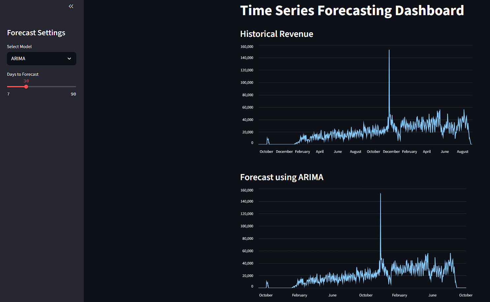

# Time Series Forecasting: Revenue Prediction

Forecast future revenue from e-commerce transactions using classic and machine learning models.

## Dataset

Data from [Olist E-Commerce Dataset](https://www.kaggle.com/datasets/olistbr/brazilian-ecommerce). Used:
- `olist_orders_dataset.csv`
- `olist_order_items_dataset.csv`

## Goal

- Forecast future revenue based on historical sales data
- Compare traditional (ARIMA, Prophet) vs ML-based model (Random Forest)
- Visualize results through an interactive Streamlit dashboard

---

## Project Structure

- `data/`: Raw and cleaned data
- `notebooks/`: EDA and modeling notebooks
- `src/`: Preprocessing and modeling scripts
- `dashboard/`: Streamlit dashboard

## Models

| Model         | Description                           | RMSE           |
| ------------- | ------------------------------------- | -------------- |
| ARIMA         | Traditional statistical time series   | 12005.58       |
| Prophet       | Additive model with trend/seasonality | 14647.65       |
| Random Forest | Tree-based ML with lag features       | 7441.51        |

## Insight

- Penjualan menurun pada saat weekend
- Ada kejadian khusus pada November 2017 yang menyebabkan lonjakan revenue sangat tinggi
- Model Random Forest lebih baik dibandingkan Prophet dan ARIMA

---

## How to Run

1. **Install dependencies**

```bash
pip install -r requirements.txt
```

2. **Run the dashboard**

```bash
cd app
streamlit run app.py
```


Made by naufaldahafizh